[](https://ci.appveyor.com/project/Sergius92739/ahj-diploma-chaos-organizer-f/branch/master)

#### Deployment:  <a href="https://sergius92739.github.io/ahj-diploma_chaos_organizer_f/">Github Pages</a>

#### Backend:  <a href="https://github.com/Redhead80/ahj-diploma_chaos_organizer_b-master">Repository</a>

#### Server:  <a href="https://ahj-chaos-organizer-sergius.herokuapp.com/">Heroku</a>

---

## Реализованные функции

### Обязательные для реализации функции (5/5)

* Сохранение в истории ссылок и текстовых сообщений

* Ссылки (то, что начинается с `http://` или `https://`) должны быть кликабельны и отображаться как ссылки


---

* Сохранение в истории изображений, видео и аудио (как файлов), с отображением превью файла - через Drag & Drop и через иконку загрузки (скрепка в большинстве мессенджеров). 

Загрузка файла при помощи иконки загрузки:

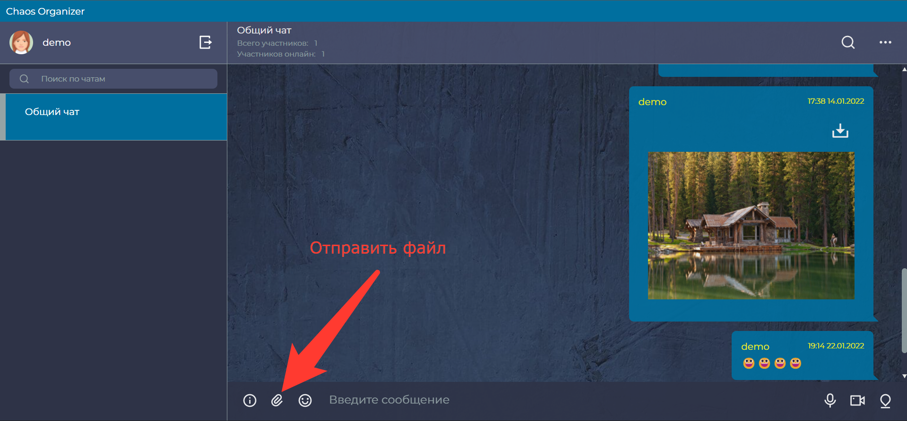

Загрузка файла при помощи Drag & Drop:

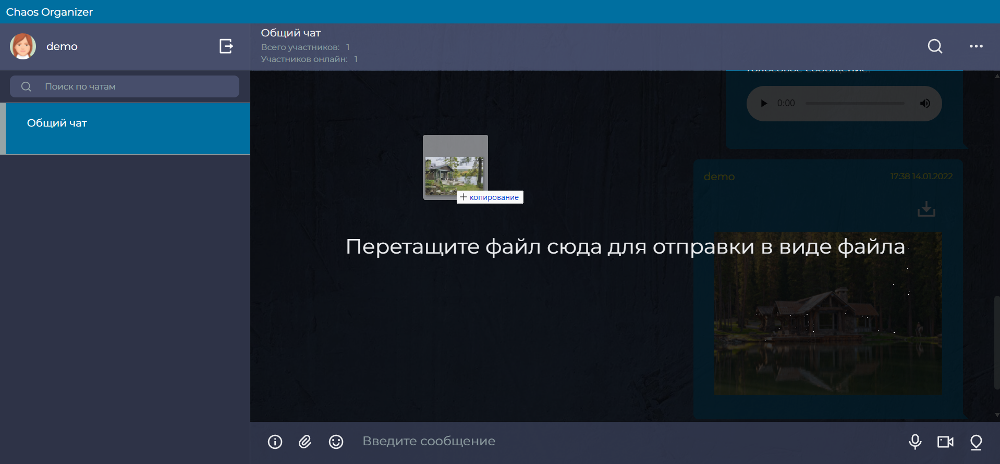

---

* Скачивание файлов (на компьютер пользователя)

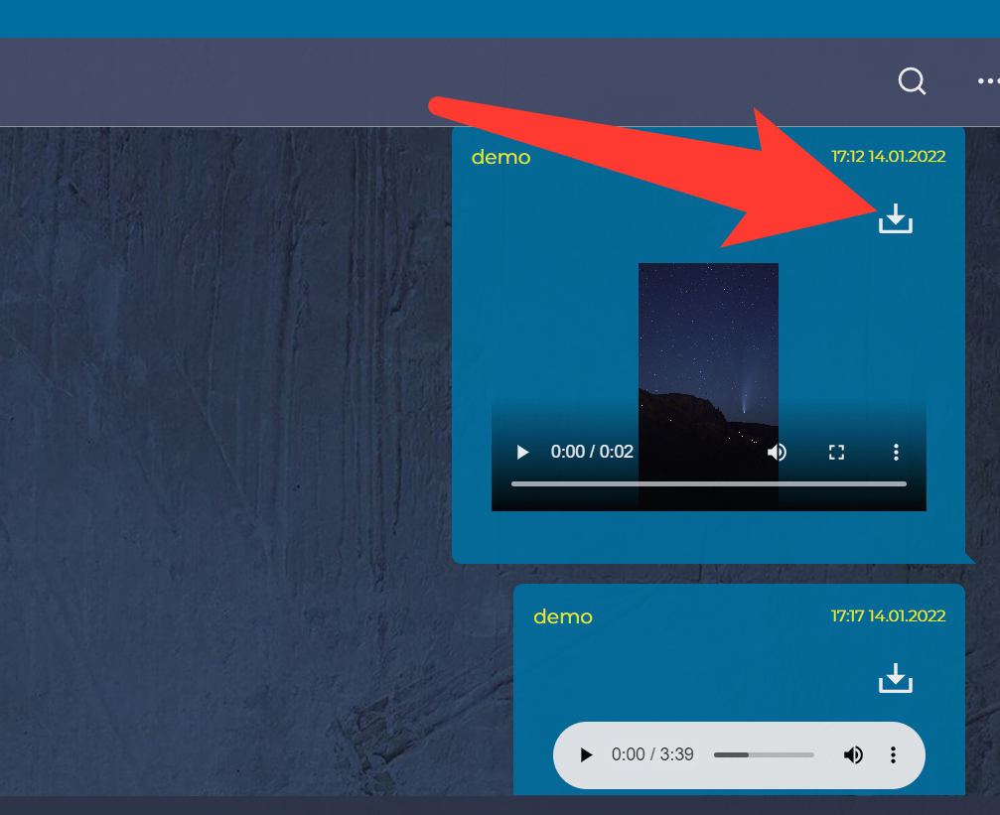

---
* Ленивая подгрузка: сначала подгружаются последние 10 сообщений, при прокрутке вверх подгружаются следующие 10 и т.д.


---
### Дополнительные для реализации функции (12/17)

* Авторизация/регистрация - при первом открытии приложения будет предложено авторизоваться или зарегистрироваться. Чтобы авторизоваться необходимо ввести свой логин и пароль и нажать кнопку `войти`. Изначально доступен один пользователь - логин: `demo`, пароль: `demo`. При успешной авторизации произойдет вход. При ошибке авторизации будет показано уведомление об ошибке. Для регистрации необходимо нажать кнопку `регистрация`, затем ввести новый логин и придуманный пароль и нажать кнопку `зарегестрироваться`. Для выхода из аккаунта необходимо нажать кнопку `выход`

Авторизация:


Регистрация:

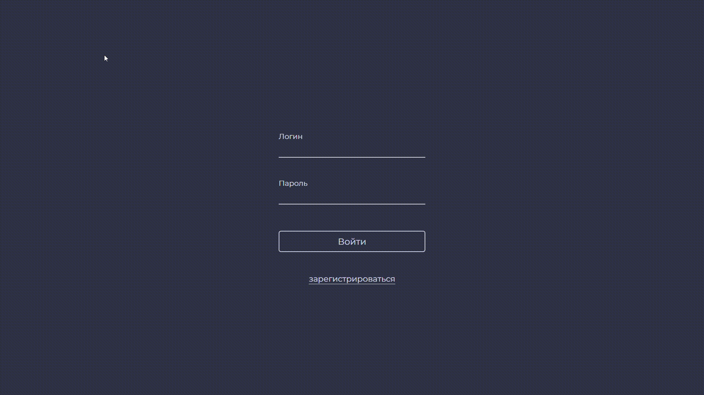

Выход из аккаунта:

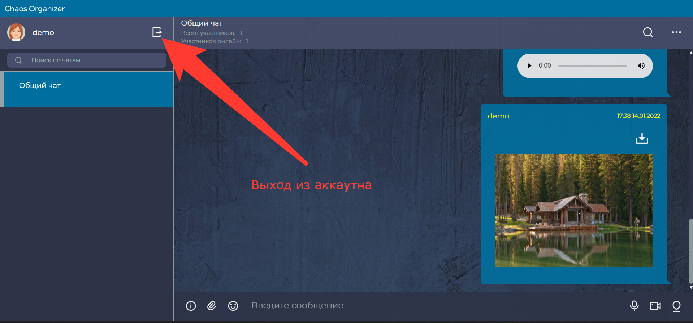

---

* Возможность загрузки аватара при регистрации. Для загрузки аватара необходимо нажать на иконку `загрузить аватар` (см. рисунок ниже). Откроется стандартное окно выбора файлов. Выберите необходимый файл. После выбора изображения появится превью аватара (см. рисунок ниже).

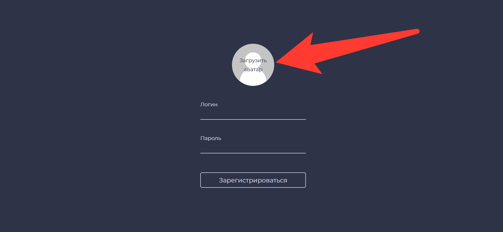
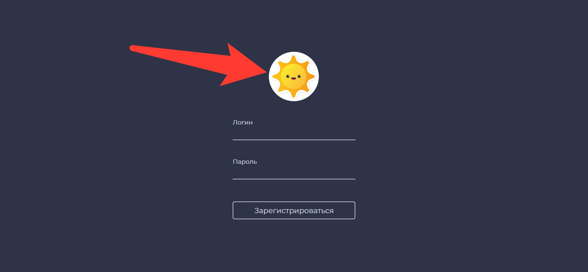

---

* Синхронизация - если приложение открыто в нескольких окнах (вкладках) или с разных устройств, то контент будет синхронизироваться.

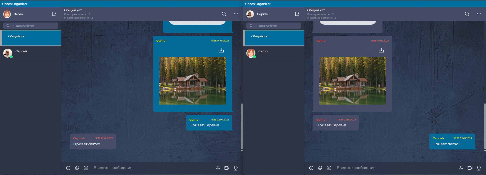


---

* Запись видео и аудио (используя API браузера). Для записи видео или аудио нужно нажать соответствующую иконку (см. рисунок ниже), после этого начнется запись и будет отображен таймер. При записи видео оно дублируется над полем ввода. Для остановки и отправки записи необходимо нажать на иконку слева от таймера, для отмены записи нужно нажать на иконку справа от таймера.

Начать запись:

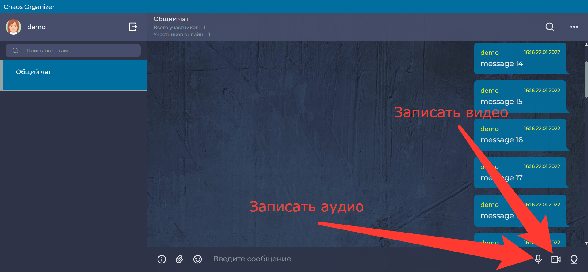

Отправить или отменить запись:

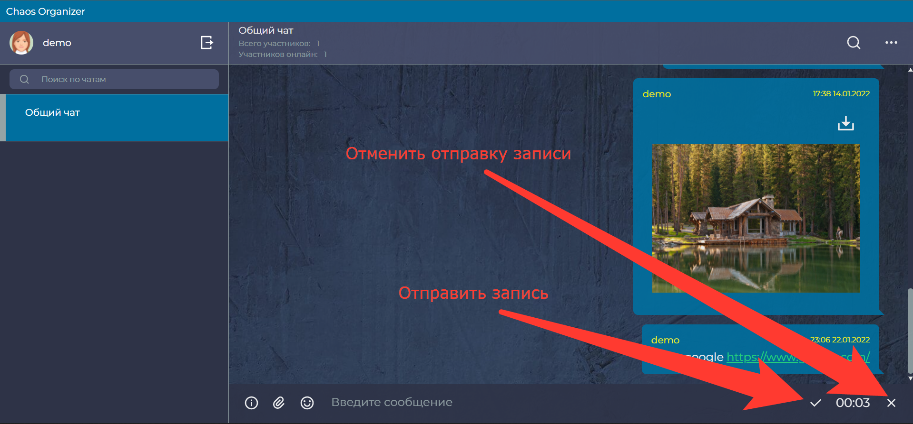

---

* Воспроизведение видео/аудио (используя API браузера)

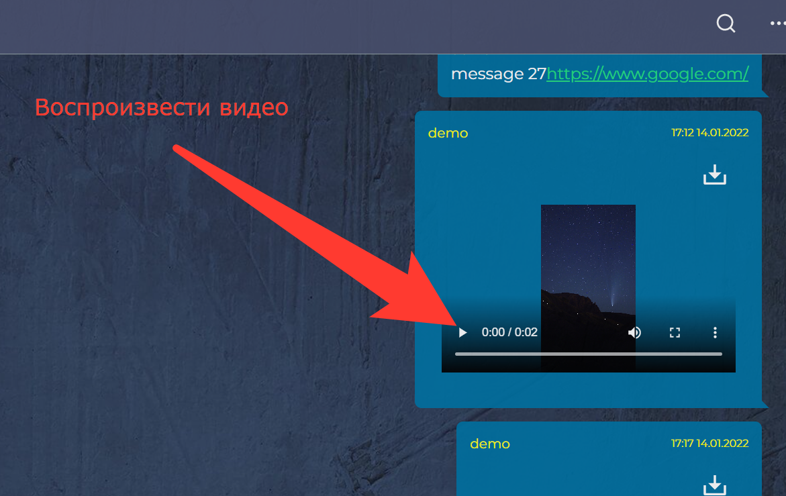

---

* Отправка геолокации и просмотр объекта в отдельном окне браузера в google картах при клике на кнопку.

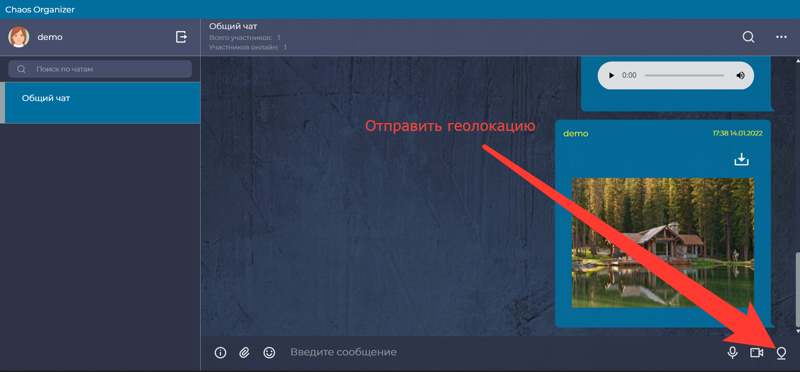
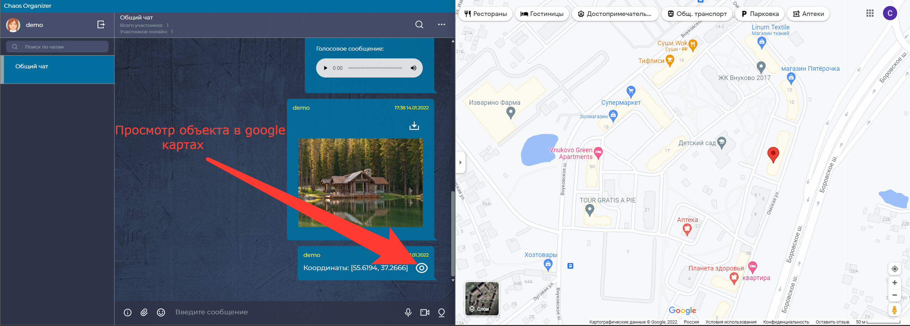

---

* Статус пользователя - если пользователь онлайн, то его аватар помечен маркером (зеленый кружок) у всех участников чата, если пользователь нажал кнопку "выход" маркер изчезает у всех пользователей.


---

* Просмотр вложений по категориям, например: аудио, видео, изображения, другие файлы (см. боковую меню Telegram)


---

* Поиск по сообщениям (интерфейс + реализация на сервере). Поиск осуществляется по тексту сообщения


---

* Поддержка смайликов (emoji)


---

* Отправка зашифрованных сообщений и файлов (привет crypto-js!) с просмотром расшированных (для этого нужно ввести пароль) - важно эта функция засчитывается за две.

Для того чтобы отправить зашифрованное сообщение необходимо нажать на соответствующую пиктограмму (см. рисунок ниже)

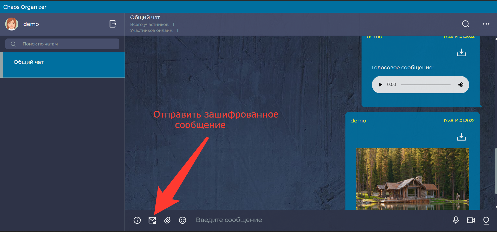

Далее будет предложено придумать пароль для расшифровки сообщения, после того как пароль будет введен и нажата кнопка `сохранить`, пиктограмма станет красного цвета и следующее отправленное текстовое сообщение или файл будут зашифрованны. Для расшифровки сообщения необходимо нажать на соответствующую пиктограмму на самом сообщении и ввести пароль. Каждый пароль действует для одного сообщения, отправленного после сохранения пароля. 

Отправка зашифрованного сообщения:


---

* Отправка команд боту, например: @chaos: погода, бот должен отвечать прогноз погоды (интеграция с реальными сервисами)

Для того чтобы получить информацию о доступных командах, необходимо нажать на соответствующую пиктограмму (см. рисунок ниже)


---

  


# Дипломное задание к курсу «Продвинутый JavaScript в браузере». Chaos Organizer
---

###### tags: `netology` `advanced js in html`

## Легенда

Мы всё больше привыкаем к неформальному формату организации информации, где ключевое - не структура, а удобство и поиск. Примеры - Slack, Telegram, WhatsApp, вплоть до помощников типа Siri или Алиса.

## Основная концепция

Ключевая идея - создать бота, который предназначен как для хранения информации, так и для поиска, и других сервисов: напоминания, уведомление и интеграция с внешними сервисами.

Назовём это глобальным ботом-органайзером - вы закидывате туда всю информацию, которая вам нужна, а он сортирует, обеспечивает поиск, хранение и напоминание.

## Прототипы

В качестве прототипов для реализации мы предлагаем вам взять функциональность Telegram, WhatsApp, Slack или подобных мессенджеров, только вместо живого собеседника у вас будет бот )).

Например, скриншот Telegram:


Или Whatsapp:


Или Slack:


## Анализ

Вам нужно провести самостоятельный анализ данных приложений (можете взять альтернативы, если не пользуетесь данными, например - Viber и т.д.), изучить их способы взаимодействия и на базе них продумать, как вы будете организовывать интерфейс, и, самое главное, какие функции в первую очередь реализовывать.

## Архитектура

Поскольку вы - автор системы и ключевой её архитектор, вам предстоит самостоятельно решить, какие технологии использовать (но Webpack, Babel, ESLint и Appveyor для развёртывания - обязательны) как на клиентской, так и на серверной стороне.

Обратите внимание, Heroku:
* будет останавливать ваше приложение (все данные, хранящиеся в памяти сотрутся)
* будет удалять все ваши файлы, которые не хранятся в Git (при остановке вашего приложения)

Поэтому несколько советов:
* чтобы каталог хранился в Git (и его не приходилось создавать средствами Node.js) поместите в каталог пустой файл .gitkeep
* захардкодьте часть демо-данных (файлы и данные в памяти), чтобы было удобно проверять и не приходилось каждый раз загружать файлы

По организации серверной части мы не требуем от вас ничего, сверх того, что проходили на лекциях (этого должно быть достаточно для реализации всех функций):
* koa (и компания)
* http-event-stream
* ws

Все данные на сервере для простоты храните в памяти в виде массива (или любого другого контейнера, который вам нравится - `Set`, `Map`).

Не думайте о проблемах, связанных с хранением данных в памяти сервера (о том, что там может храниться слишком много сообщений).

## Ключевые функции

Мы, конечно, немного схитрили и уже за вас продумали ряд функций, которые обязательно должно включать в себя приложение.

Все функции разбиты на две категории:
1. Обязательные
1. Дополнительные

Все функции из `обязательных` должны быть реализованы.
Из `дополнительных` должно быть реализовано **не менее 5**, вы **сами решаете какие 5** (можете и больше) это будут.

### Обязательные для реализации функции

* Сохранение в истории ссылок и текстовых сообщений
* Ссылки (то, что начинается с `http://` или `https://`) должны быть кликабельны и отображаться как ссылки
* Сохранение в истории изображений, видео и аудио (как файлов) - через Drag & Drop и через иконку загрузки (скрепка в большинстве мессенджеров)
* Скачивание файлов (на компьютер пользователя)
* Ленивая подгрузка: сначала подгружаются последние 10 сообщений, при прокрутке вверх подгружаются следующие 10 и т.д.

### Дополнительные для реализации функции

* Синхронизация - если приложение открыто в нескольких окнах (вкладках), то контент должен быть синхронизирован
* Поиск по сообщениям (интерфейс + реализация на сервере)
* Запись видео и аудио (используя API браузера)
* Отправка геолокации
* Воспроизведение видео/аудио (используя API браузера)
* Установка напоминаний и напоминания (через Notification API), например `@schedule: 18:04 31.08.2019 "Последний день лета"`
* Отправка команд боту, например: `@chaos: погода`, бот должен отвечать рандомный прогноз погоды (интегрироваться с реальными сервисами не требуется), команд должно быть не менее 5
* Закрепление (pin) сообщений, закреплять можно только одно сообщение (прикрепляется к верхней части страницы):


* Добавление сообщения в избранное (тогда должен быть интерфейс для просмотра избранного)
* Просмотр вложений по категориям, например: аудио, видео, изображения, другие файлы (см. боковую меню Telegram)
* Работа в оффлайн-режиме (при это загруженные сообщения должны кэшироваться и быть доступными после обновления страницы)
* Экспорт/импорт истории чата
* Отправка зашифрованных сообщений и файлов (привет crypto-js!) с просмотром расшированных (для этого нужно ввести пароль) - **важно эта функция засчитывается за две**
* Архивирование файлов и распаковка (см. zip.js)
* Поддержка оформления кода, например, при отправке сообщения в бэктиках:
  <pre>
  ```
  if (true) {
    console.log('Hello, AHJ!');
  }
  ```
  </pre>

  это должно выглядеть как:
  ```javascript
  if (true) {
    console.log('Hello, AHJ!');
  }
  ```
* Поддержка смайликов (emoji)
* Поддержка стикеров


Если вы придумали интересную функцию, но её нет в этом списке, обращайтесь к @coursar.

## Требования к оформлению

### Визуальное оформление

Мы никак не ограничиваем вас с точки зрения визуального оформления, но помните, что хорошо бы, чтобы человек, уже знакомый с вышеописанными мессенджерами, без труда смог пользоваться вашим приложением.

### Техническое оформление

Всё должно быть оформлено в виде публичного репозитория на GitHub.

Для фронтенда обязательно: Webpack, Babel, ESLint и Appveyor для развёртывания.

Клиентская часть должна быть выложена на GitHub Pages (не забудьте разместить бейджик сборки и ссылку на развёрнутое приложение) либо вместе с серверной на Heroku.

### Документация

Обязательно должен быть файл README.md, в котором описано, какие функции вы реализовали и как ими пользоваться (в картинках).

**Важно**: если функция не описана, считается, что её нет.
